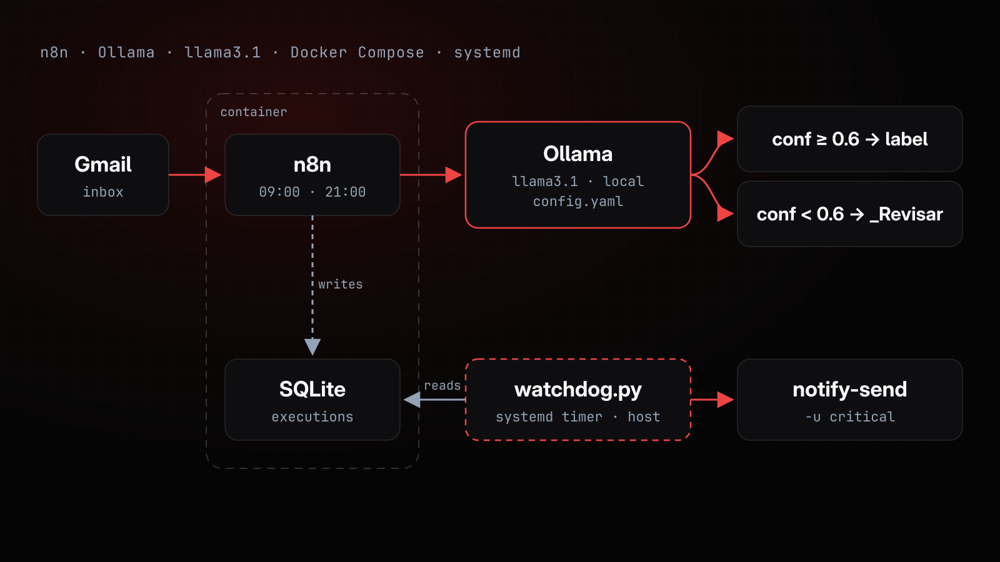

# Triagem de E-mail com LLM Local (n8n + Ollama)

Classifica os e-mails do Gmail em 8 categorias semânticas com um LLM rodando localmente
(Ollama, `llama3.1`), orquestrado por **n8n** self-hosted em Docker Compose. Nenhum conteúdo
de e-mail vai para API de terceiro: o modelo roda no próprio host, sem custo por chamada.



## Como funciona

1. Um fluxo agendado do n8n (09:00 e 21:00) busca os e-mails que ainda não têm label.
2. O nó `Classificar` monta o prompt com as descrições das 8 categorias do `config.yaml` e
   chama o Ollama pedindo JSON: `label`, `needs_action`, `confidence` e `reason`.
3. Com confiança de 0,6 ou mais e label dentro da lista, o e-mail recebe o label da categoria
   (e `Ação necessária`, quando for o caso). Label fora da lista, confiança baixa ou falha de
   rede → `_Revisar`. A fila nunca trava.
4. Cada classificação vira uma linha JSON em `~/.n8n/triagem-log.jsonl`, para auditoria.
5. No host, um watchdog confere duas vezes por dia se o fluxo continua processando.

## Início rápido

Pré-requisitos: Docker, o Ollama com o modelo `llama3.1` escutando na bridge do Docker
([setup, passos 1 e 2](docs/setup.md#1-ollama--o-modelo-local-que-classifica)) e uma
credencial OAuth2 do Gmail no n8n ([passo 3](docs/setup.md#3-credencial-gmail-oauth2-no-n8n)).

```bash
git clone https://github.com/ClaudineiAlves/triagem-email-llm.git && cd triagem-email-llm
cp config.example.yaml config.yaml   # troque os IDs dos labels pelos seus (passo 4)
mkdir -p ~/.n8n
docker compose up -d                 # n8n em http://localhost:5678
docker exec n8n wget -qO- http://host.docker.internal:11434/api/tags   # deve listar o llama3.1
```

Depois importe o `workflow.json` no n8n, selecione a credencial do Gmail e ative o fluxo
([passo 5](docs/setup.md#5-importar-e-ativar-o-fluxo)).

O setup foi escrito para Arch Linux. Em Debian ou Ubuntu, instale o Docker e o Ollama como
na [Fase 3 do deploy na Oracle](docs/deploy-oracle.md#fase-3--docker--ollama-na-vm), que usa
os instaladores genéricos.

## Documentação

| Documento | Conteúdo |
|---|---|
| [Setup local](docs/setup.md) | Ollama, Docker e n8n, credencial do Gmail, labels, importação do fluxo e watchdog |
| [Deploy na Oracle Cloud](docs/deploy-oracle.md) | A mesma stack 24/7 numa VM Always Free, sem reautorizar o Gmail |
| [Operação](docs/operacao.md) | Ajustar a classificação, backfill, auditoria e troubleshooting |

## Decisões de projeto

- **Configuração fora do fluxo.** Prompt, descrições das categorias, limiar e modelo ficam no
  `config.yaml`, montado read-only no container. Trocar categoria ou ajustar o prompt não
  exige mexer no workflow.
- **Limiar com rota de revisão.** Abaixo de 0,6 o e-mail vai para `_Revisar` em vez de receber
  um rótulo chutado. O prompt pede que o modelo use a escala de confiança inteira, para que os
  casos ambíguos caiam na revisão, e não num palpite.
- **Saída do modelo validada.** A resposta passa por `JSON.parse` com try/catch e o label tem
  de estar na lista de categorias; qualquer outra coisa vai para revisão.
- **Watchdog fora do container.** O aviso precisa sobreviver justamente ao que costuma quebrar
  (container parado, OAuth do Gmail revogado). Por isso roda no host, disparado por um timer do
  systemd, e alerta por `notify-send`, não por e-mail. Nasceu depois que uma credencial
  expirou em silêncio e a triagem ficou **38 dias parada sem ninguém notar**.

## Diagnóstico: labels inventados, sem erro nenhum

Com `ollama_num_ctx: 1024` e um prompt de ~1.410 tokens, o modelo perdia a lista de categorias
e passava a inventar labels (`marketing`, `Oportunidade`, `spam`), acertando 1 de 16 casos —
sem lançar erro nenhum. A correção foi dimensionar a janela de contexto pelo tamanho do prompt
(hoje `3072`, com folga para um prompt de ~1.760 tokens) e medir de novo sempre que as
descrições das categorias mudam. A regra de bolso está no `config.yaml`: `chars / 3.3 ≈ tokens`.

## Stack

Python · n8n · Ollama (`llama3.1`) · Docker Compose · SQLite · systemd · YAML ·
JavaScript (Code nodes do n8n)

---

## Arquivos

| Arquivo | O quê |
|---|---|
| `docker-compose.yml` | Sobe o n8n self-hosted com as envs necessárias |
| `config.example.yaml` | Modelo do `config.yaml`: categorias, prompt, limiar de confiança e mapa de IDs dos labels |
| `config.yaml` | Sua cópia local do modelo, com os IDs dos seus labels (fora do git) |
| `workflow.json` | Fluxo n8n importável da triagem ao vivo (4 nós) |
| `backfill.json` | Fluxo n8n importável para classificar emails **antigos** em lote (ver [Backfill](docs/operacao.md#backfill--classificar-emails-antigos)) |
| `nodes/classificar.js` | Código do Code node de classificação (cópia editável) |
| `nodes/log.js` | Código do Code node de log estruturado |
| `watchdog.py` | Watchdog que alerta quando a triagem para (roda no host, fora do container) |
| `systemd/` | Units `triagem-watchdog.service` e `.timer` (checagem às 10:30 e 22:30) |
| `dns-watch.sh` | Renova o DNS do container n8n a cada troca de rede |

> O fluxo tem 4 nós. O `IF (confiança)` da especificação foi consolidado **dentro**
> do nó `Classificar` (comparar float em expressão do n8n é frágil; em código é
> determinístico). O comportamento é idêntico: `confidence < confidence_threshold`
> → `_Revisar`. Se preferir o IF visível, é trivial reintroduzir.

## Fluxo

`Gmail Trigger` → `Classificar` (Ollama + validação + resolve labelIds) → `Aplicar label` → `Log`

- **Gmail Trigger**: DESATIVADO desde 13/08/2026. O poll de 2 min nunca deixava passar
  os 5 min de `keep_alive` do Ollama, então o modelo (~5,6 GB) ficava residente na RAM
  24h por dia. O backfill diário cobre exatamente o mesmo conjunto de emails, porque
  `-has:userlabels` contém `is:unread -has:userlabels`.
- **Classificar**: lê `config.yaml`, chama o Ollama (`/api/chat` com `format: json`),
  faz `JSON.parse` com try/catch. Label fora da lista, baixa confiança ou falha de
  rede → `_Revisar`. Nunca trava a fila.
- **Aplicar label**: `messages.modify` por ID de label (retry 3x, backoff 2s).
- **Log**: anexa linha JSON em `~/.n8n/triagem-log.jsonl` (auditoria).


## Licença

[MIT](LICENSE).
